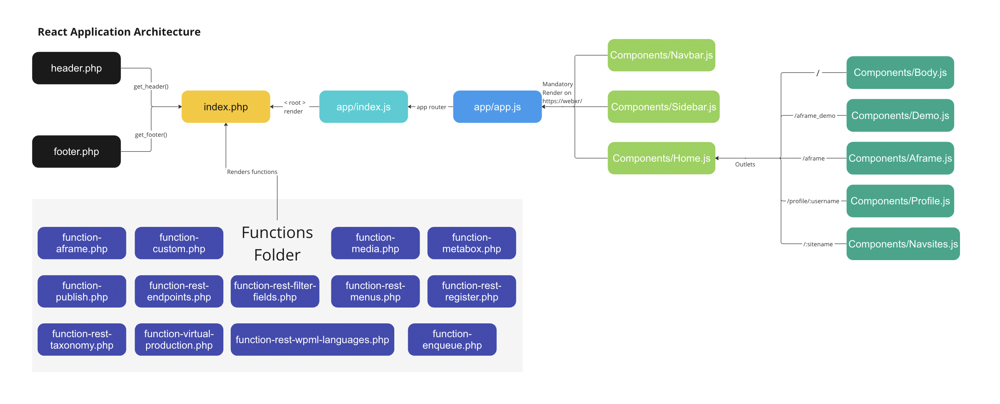
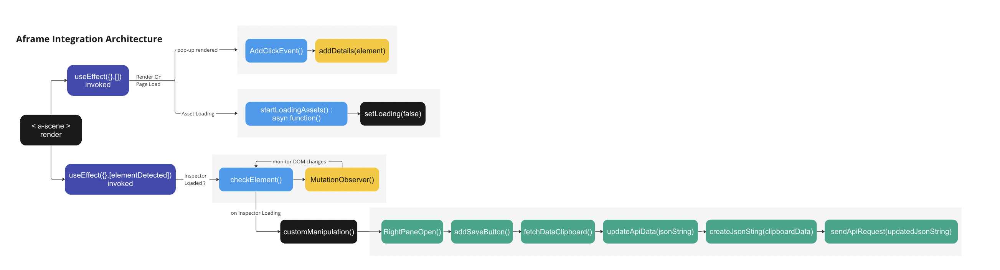

# App Component

## **Routing and Data Management**

The code sets up the routing configuration for the application, fetches menu data based on the selected language, and renders the appropriate components based on the current route. It utilizes context providers to efficiently manage and share data across components.

### **Router Configuration**

The **`appRouter`** is created using the **`createBrowserRouter`** functions, defining the various routes and their corresponding components. For example, when the root route ("/") is accessed, the application displays a combination of the **`Navbar`**, **`Sidebar`**, and **`Home`** components. This routing configuration allows for a seamless navigation experience within your application.

### **App Component**

The **`App`** component, implemented as a functional component, plays a central role in fetching and managing the menu data. The **`useEffect`** hook is utilized to trigger the fetching process whenever the **`lang`** state variable changes. This ensures that the menu data is always up-to-date with the selected language.

Fetching the menu data is done by constructing a fetch URL using the **`base_url`** and **`lang`** variables. The application then retrieves the relevant menu data from the server. Once the data is fetched, it undergoes a filtering process to extract the items belonging to the "main-menu" category.

### **Context Providers**

To facilitate efficient data sharing and management across components, the **`App`** component returns a hierarchy of context providers. These context providers include the **`DataContext`**, **`StagingDataContext`**, and **`MenuDataContext`**.

The **`DataContext`** provider allows components to access and modify shared data, providing a central source of truth for the application. The **`StagingDataContext`** provider specifically manages the **`stagingData`** state variable, which holds the retrieved menu items. This ensures that components dependent on the menu data can easily access it.

The **`MenuDataContext`** provider is responsible for handling the menu-related data, enabling components to access and update the menu information as needed.

### **Loading State**

To enhance the user experience, the code includes a loading message if the **`stagingData`** array is empty. This message informs the user that the application is in the process of fetching the menu data. Once the data is successfully retrieved, the loading message disappears, and the components are rendered with the updated menu information.


# Navbar Component

- The code imports necessary dependencies from React and other modules to ensure the smooth functioning of the application. Additionally, it imports a CSS file named "style.scss" from the "@styles" directory. This allows for the styling of the components and ensures a visually appealing user interface.
- Inside the **`Navbar`** component, several state variables are defined using the **`useState`** hook. These variables include **`showMenu`**, **`navbarMenus`**, **`c2IDs`**, **`languageArr`**, and **`hoveredIndex`**. These state variables are utilized to manage the state and behavior of the navigation bar.
- The **`useEffect`** hook is employed to execute certain functions, namely **`settingMenuData`** and **`setLanguages`**, whenever the **`stagingData`** state variable undergoes a change. This ensures that the necessary menu data and language information are updated accordingly, providing an up-to-date navigation experience.
- The **`formatNames`** function plays a role in transforming the names by converting them to lowercase and capitalizing the first letter of each word.
- The **`settingMenuData`** function processes the **`stagingData`** and extracts the relevant menu items and their corresponding child items. It sets the state variables **`c2IDs`** and **`navbarMenus`** based on the processed data. This function is crucial for organizing and structuring the menu data, ensuring that it can be efficiently utilized in rendering the navigation bar.
- The **`Navbar`** component returns JSX code that represents the navigation bar. It consists of a navigation elements.
- By employing these functionalities, the **`Navbar`** component allows for dynamic rendering of the navigation bar based on the state variables and menu data. The usage of hooks, such as **`useState`** and **`useEffect`**, enables effective state management and updates when needed.

# **NavSites Component**

- The code begins by importing necessary dependencies from React and other modules. It utilizes the **`useParams`** hook from the **`react-router-dom`** library to extract parameters from the URL.
- Inside the **`NavSites`** component, the code uses the **`useParams`** hook to extract the **`sitename`** and **`sn`** parameters from the URL. These parameters likely hold information related to the current site and its specific details.
- To access the **`lang`** state variable, the code employs the **`useContext`** hook from React. It retrieves the **`lang`** value from the **`DataContext`**, allowing the component to use the selected language in its functionality.
- Similarly, the **`stagingData`** state variable is obtained from the **`StagingDataContext`** using the **`useContext`** hook. This variable likely holds the fetched menu data that was filtered and stored for use throughout the application.
- To filter the **`stagingData`** and obtain the corresponding content based on the **`sitename`** and **`sn`** parameters, the code defines the **`filteredMenuData`** variable using the **`useMemo`** hook. By applying filtering logic, this variable ensures that only the relevant content is returned for rendering.
- The **`NavSites`** component then returns JSX code that renders the filtered menu data. The content is inserted using the **`dangerouslySetInnerHTML`** attribute. This attribute allows the insertion of HTML content without escaping special characters, ensuring that the content is rendered as intended.
- By incorporating these functionalities, the **`NavSites`** component provides a dynamic rendering of the filtered menu data based on the **`sitename`** and **`sn`** parameters. The usage of context providers and hooks facilitates the seamless integration of shared data and enhances the overall user experience.


# Demo



The flow of the code can be seen as shown.

Attributes of Importance

1. `[loading, setLoading]` : Indicates the loading of assets,once loaded loading is set to true.
2. `[elementDetected, setElementDetected]`: Looks for presence of Inspector on the DOM. If inspector has been opened is set to true.

Function Descriptions:

1. `checkElement()`: Checks for a specific element which if rendered on the DOM indicates the presence of an opened inspector. Checks if it has been opened for the first time and only then causes manipulations to it.
    1. `customManipulation()` : Organiser function sequentially calls the below.
        1. `RightPaneOpen()`: Since manipulations have to be performed on the inspector, the right pane of the inspector panel has to be opened. The element( <a-scene> ) is selected and clicked to open this pane.Delays are added force time for alteration on the DOM and its rendering.

```
var ele = document.querySelector(
        "#scenegraph > div.outliner > div:nth-child(1)"
      );
```

1. `addSaveButton()`: The new element which acts as a button to have the functionality of saving the alterations is rendered here. It is the same as the “copy entity HTML to clipboard” , i.e. the rightmost element in the div.

This augmented button first augments the entity contents on the clipboard.

```jsx
var parentElement = document.querySelector(
        "#componentEntityHeader > div.static > div.collapsible-header > div"
      );
      parentElement.appendChild(link);
```

1. fetchDataClipboard(): On-click of this newly-augmented button, the data copied on the clipboard is accessed.

```jsx
element.onclick = function () {
      // Usage: Access the data from the clipboard and store it in a variable "clipboardData"
      navigator.clipboard.readText().then(function (clipboardData) {
        console.log("Clipboard Data as fetched : ", clipboardData);
        createJsonSting(clipboardData);
```

1. `createJsonSting(clipboardData)`: The clipboard data in a format similar to shown below is transformed to a json element.

```jsx
var entityAttributes = tempElement.firstChild.attributes;
    // Convert the attributes into an object
    var entityObject = {};
    for (var i = 0; i < entityAttributes.length; i++) {
      var attr = entityAttributes[i];
      entityObject[attr.name] = attr.value;
    }
    // Convert the object to JSON string
    var jsonString = JSON.stringify(entityObject);
```

---

1. updateApiData(jsonString): Checks id of the element. If it already exists in the API data, replaces the entity else adds it as a new one.

```jsx
var foundClassData=false;
    const updatedData = data.map((item) => {
      if (item.class !==undefined && newData.class!==undefined && newData.class===item.class) {
        console.log("Found Class Updation");
        foundClassData = true
        var alteredClassData=updateClassData(newData);
        return alteredClassData;
      }
      else if (newData.id !== undefined && item.id === newData.id) {
        console.log(newData.id);
        console.log("Found the item to update");
        foundData = true;
        return newData;
      } else{
        console.log("Not the item to update");
        return item;
      } 
    });

    if (!foundData && newData.id!==undefined && newData.class===undefined) updatedData.push(newData);
```

1. sendApiRequest(updatedJsonString): Sends API request and response rendered as an alert() pop-up. Page is subsequently reloaded.

```jsx
const url = `${base_url}/wp-json/myroutes/update_inspecter`;
    var formdata = new FormData();
    formdata.append("file", new Blob([data]));
```

1. AddClickEvent();
    1. AddDetails(Obj)
2. startLoadingAssets(): Sets loading attribute to true and causes the site to wait for 10 seconds before any other action. Necessary to allow assets to load up and the be subsequently rendered.

React Return Component:

- <a-scene> initialized and forest environment set
- Rigging added for VR experience
- Static assets- Room and NavMesh loaded
- Dynamic assets loaded through React script, with different initializations for gltf models and images
- Assets are subsequently rendered
- Lighting fixed