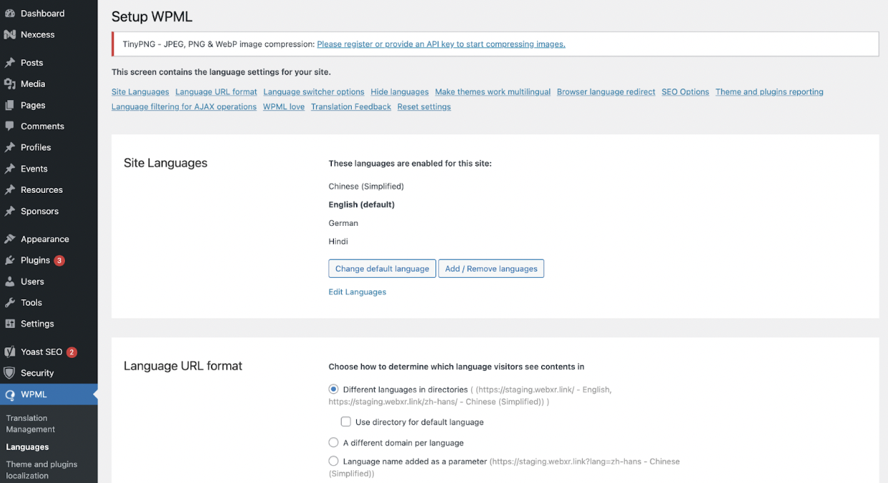
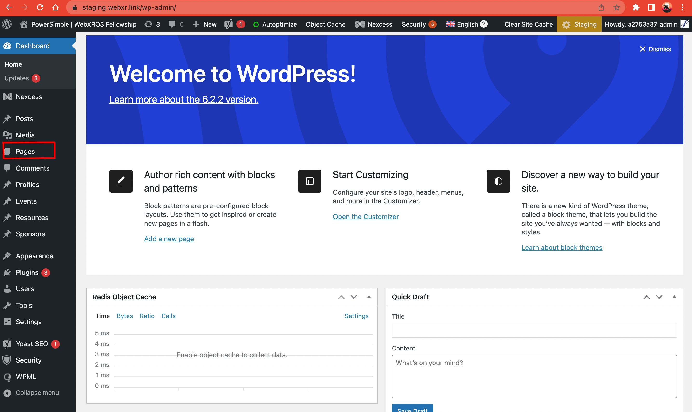
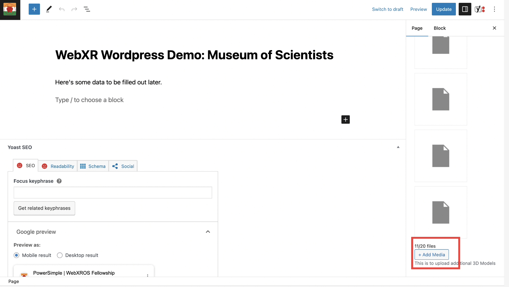
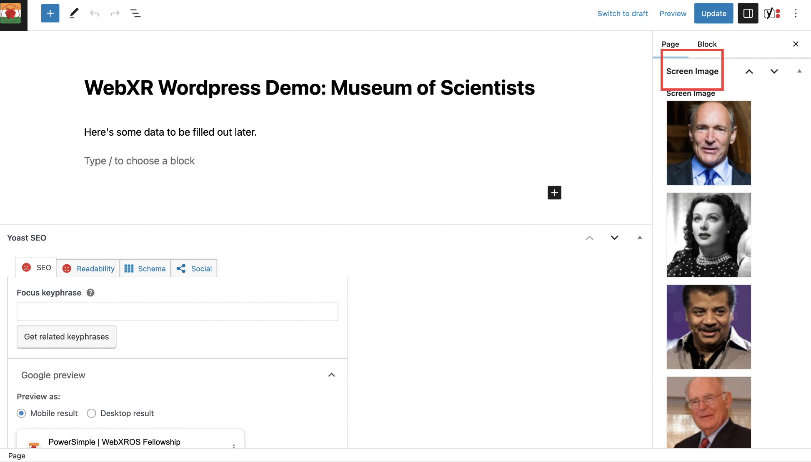

# Makers

A Pilot Repository for the XROS Fellowship x Powersimple Project.

## Objective

This hybrid uses AFrame with Wordpress. We are looking forward to building the Aframe functions that would help us to edit or alter the progress in WebXR, while developing. A collection of experiences made with WebXR, which brings together AR and VR on the web to make them more convenient and widely accessible. We’re making it more viable by giving the accessibility to explore more with WebXR. Are you tired of switching back and forth between your text editor, the Inspector, and refreshing? Now you can save your changes from the Inspector directly to your HTML files. The Inspector has built-in support with a save button for the Watcher. Just make sure your entities have defined IDs.

## Setting Up For Developers

1. Use a suitable server engine to set up wordpress, phpMyAdmin and Apache.
2. Inside the wordpress folder, look for wp-content > themes , clone the makers repository here.
3. Set up database from sql folder
4. Add the following plugins:

   ```
   * CMS Page Tree View
   * Admin Menu Tree Page View
   * Enable Media Replace
   * Hide Admin Bar
   * Metabox
   * SVG Support
   * WP REST API - filter fields
   * WPML CMS Nav
   * WPML Media
   * WPML Multilingual CMS
   * WPML Sticky Links
   * WPML String Translation

   ```
5. Add the following commands to wp-config:

   ```
   // to redirect to localhost
   define('WP_HOME','[https://localhost/yourinstall/'](https://localhost/yourinstall/' "https://localhost/yourinstall/'"));
   define('WP_SITEURL','[https://localhost/yourinstall/'](https://localhost/yourinstall/' "https://localhost/yourinstall/'"));

   //this is needed to post glbs
   define('ALLOW_UNFILTERED_UPLOADS', true);

   ```
6. lnstall node modules

```
   npm install

```

7. lnstall node modules

   ```
   npm run start

   ```
8. Alter webpack.config.js proxyurl to correspond to your local url.

## Description

###  Data access through REST API in JSON Format:

This project leverages the WordPress REST API to enable data access in JSON format. The REST API allows for seamless communication between the front-end and back-end of the application.
The REST API returns data in JSON (JavaScript Object Notation) format, which is a lightweight and widely supported data interchange format.
Using JavaScript, you can make HTTP requests to the REST API endpoints to retrieve data.

###  Responsive Mega Navigation Menu

This project includes a responsive mega navigation menu, designed to provide an enhanced user experience on different devices and screen sizes. The menu is optimised to handle a large number of navigation items and accommodate additional content, such as dropdown menus,  and icons.

The responsive nature of the mega navigation menu ensures that it adapts to various screen sizes, including desktops, tablets, and mobile devices. It utilizes responsive design techniques, such as media queries and flexible layout structures, to deliver an optimal navigation experience across different devices.

The menu supports dropdown functionality, allowing for nested navigation items and hierarchical organisation of content. This enables you to create multi-level navigation structures for better organisation and accessibility.

Currently the navbar is designed in such a way that it has the following sections:

2) the right part has 2 dropdown one is profile and other is languages and then the right most part is social media icons .

1. Left Part:
   - Logo: Displayed at the leftmost side of the navbar.
   - Name: Displayed next to the logo.
2. Right Part:
   - Profile Dropdown: Located on the right side of the navbar. When clicked or hovered over, it expands to show options related to the user's profile, on clicking the name of the member, the respective profile will be shown.
   - Languages Dropdown: Also located on the right side of the navbar, typically adjacent to the profile dropdown. When clicked or hovered over, it expands to display a list of available languages or language settings for the website. Users can choose their preferred language from this dropdown.
   - Social Media Icons: Positioned on the rightmost side of the navbar. These icons represent links to social media profiles. Common icons include those for Facebook, Twitter, Github LinkedIn, YouTube, etc. Clicking on these icons would redirect users to your social media pages.

###  Multi-lingualism.

In order to make the project more accessible and inclusive to a global audience, multilingualism is implemented. This feature allows users to interact with the website or application in their preferred language, providing a localized experience and breaking language barriers.
To achieve this, we have integrated the WPML (WordPress Multilingual) plugin into our project. WPML is a robust and widely-used tool specifically designed for translating and localizing WordPress websites.
Key WPML Plugins Used:
1. WPML CMS Nav : This plugin adds CMS navigation elements to our website/application, making it easier for users to navigate through the content in their preferred language. It ensures a seamless multi-lingual experience.
2. WPML Media : With WPML Media, we have added multilingual support for media files. Users can now enjoy our content with translated media, ensuring a consistent experience across different languages.
3. WPML Multilingual CMS : WPML Multilingual CMS is a core plugin that forms the foundation of our multilingual implementation. It provides a robust translation management system, allowing us to efficiently manage and translate our website/application content.
4. WPML Sticky Links: The WPML Sticky Links plugin prevents internal links from breaking, ensuring that users can navigate through our website/application seamlessly, regardless of the language they choose.
5. WPML String Translation: WPML String Translation helps us translate strings and texts from themes, plugins, and other elements within our website/application. It ensures that all aspects of our content are accurately translated.

By incorporating multi-lingual support, it enables users to switch between different languages, ensuring that the content and interface are presented in a language they are comfortable with. This can greatly improve accessibility for users who may not be fluent in the default language.

Currently we have Integrated Four Languages : 
- English (Default) 
- Dutch
- Hindi
- Chinese

One can Navigate to Wordpress → WPML → Languages section to change the default language or add language.



### Accessibility.

This project prioritizes accessibility by incorporating various features to enhance usability and accommodate diverse user needs. The following accessibility features have been implemented:

1. High Contrast: Users can switch to a high contrast mode, which increases the color contrast between text and background elements. This makes the content more legible for individuals with visual impairments or who prefer higher contrast settings.
2. Greyscale: The project offers a greyscale mode that converts the color scheme to grayscale. This can be helpful for users with visual impairments or who find it easier to perceive content without color distractions.
3. Font Size Adjustment: Users have the option to increase or decrease the font size to suit their reading preferences. Increasing the font size improves readability for individuals with visual impairments or those who require larger text for comfortable reading.
4. Dark Mode: Dark mode provides an alternative color scheme with dark backgrounds and lighter text. This can reduce eye strain and enhance readability, particularly in low-light environments.
5. Dyslexia Friendly Mode: The project includes a dyslexia-friendly mode that incorporates features like customized fonts and letter spacing to improve readability for individuals with dyslexia or reading difficulties.
6. Word Spacing Adjustment: Users can adjust the spacing between words, allowing for increased or decreased word spacing based on individual reading preferences. This can benefit users with reading challenges or visual impairments.
7. Focus Mode: Focus mode helps users concentrate on the content by minimizing distractions. It removes unnecessary elements from the interface and emphasizes the main content area, providing a cleaner and more focused reading experience.
8. Reset: The project provides a reset option that allows users to revert back to the default settings, undoing any modifications made to the accessibility features. This ensures flexibility and allows users to customize their experience according to their needs.

###  Added Routing, Profile Pages

The project includes profile pages that showcase information about individuals. Each profile page typically consists of the following components:

1. Name Heading: The profile page prominently displays the name of the person whose profile it represents.
2. Profile Photo: A profile photo is included on the page, providing a visual representation of the person.
3. Profile Information: The profile page contains relevant information about the person.

###  Dynamic A-Frame Integration with WordPress.

This integration allows users to seamlessly incorporate A-Frame, a powerful virtual reality framework, into your WordPress website. One of the standout features of this integration is the A-Frame inspector, which enables users to make real-time changes to the virtual reality environment.

#### Inspector Functionality*

When the A-Frame inspector is activated, users gain access to a set of intuitive tools for modifying the virtual reality scene. These tools allow users to manipulate objects, adjust positions, modify textures, and more, all within the browser window.

#### Save Button*

To enhance the functionality of the A-Frame inspector, we have implemented a convenient "save" button. Once the user has made changes using the inspector for a particular entity, they can simply click on the "save" button. This action triggers the saving of the modified code directly back into the original JSON code file associated with the A-Frame environment for rendering of the entity.

#### Seamless Code Management*

With the integrated save button, users can effortlessly preserve their modifications and ensure that the changes persist across sessions. By saving the updated code back into the JSON file, the virtual reality environment maintains the latest changes made by users, providing a seamless and dynamic user experience.

#### Inspector Update API Integration*

Generated POST requests to update the component data dynamically as is changed using the inspector and the custom save-button functionality.

#### Steps to upload content to A-Frame:

1. Visit the WordPress site.
2. Access the left panel and select the "Pages" option.



3. Create a new page.   (Note: Currently, there is a page titled "WebXR Wordpress Demo: Museum of Scientists" already created.)


4. In the right panel of the page, locate the "3D Properties" section and add the world model, navmesh model, and furniture (along with other 3D models).



5. To include images, go to the "Screen Images" section in the right panel of the page.



6. After uploading the content, navigate to the A-Frame scene and open the A-Frame inspector.
7. You will find the uploaded content in its default position, specified as "0 1.6 0".
8. You can adjust the position and size of the element by moving and resizing it.
9. Click on each position and press "Enter" once.
10. Click on each position and press "Enter" once. (This is because of [issue](https://github.com/aframevr/aframe/issues/4084)
).
11. Finally, click the "Save" button to save the changes.


